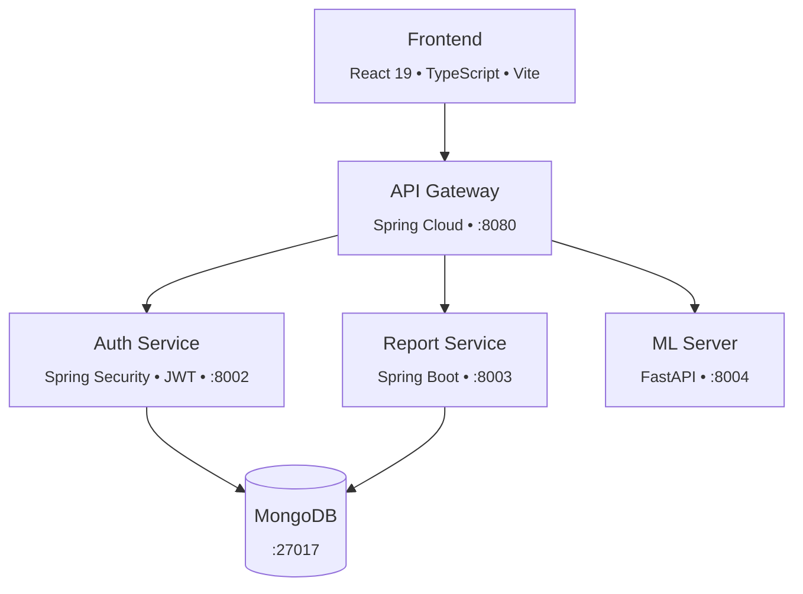

<div align="center">

# Crash2Cost

### From crash photo to repair estimate — powered by AI

[](https://react.dev/)
[](https://spring.io/projects/spring-boot)
[](https://fastapi.tiangolo.com/)
[](https://pytorch.org/)
[](https://www.mongodb.com/)

---

**Crash2Cost** analyzes vehicle damage photos using a three-stage ML pipeline to automatically detect damaged areas, classify severity, and predict repair costs.

</div>

## How It Works

```mermaidךך
flowchart LR
    A["Upload Photo"] --> B["Detect Damage<br/><sub>YOLOv8</sub>"]
    B --> C["Classify Severity<br/><sub>ResNet</sub>"]
    C --> D["Estimate Cost<br/><sub>Random Forest</sub>"]
    D --> E["Assessment Report"]
```

| Stage | Model | Output |
|:------|:------|:-------|
| Detection | YOLOv8 | Bounding boxes around damaged regions |
| Classification | ResNet | Damage type + severity score (1–5) |
| Cost Estimation | Random Forest | Repair cost in ILS |

> **7 damage types supported:** bumper dent, bumper scratch, door dent, door scratch, glass shatter, head lamp, tail lamp

## Architecture



## Project Structure

```
crash2cost/
├── frontend/client/        React web application
├── backend/
│   ├── api-gateway/        Spring Cloud Gateway
│   ├── auth-service/       JWT authentication
│   └── report-service/     Assessment reports
├── machines/
│   ├── detection-model/    YOLOv8 damage detection
│   ├── severity-model/     ResNet classification
│   ├── cost-model/         Cost estimation
│   └── ml-server/          FastAPI inference server
└── Scripts/                Service automation
```

## Getting Started

### Prerequisites

- **Java** 25
- **Node.js** & npm
- **Python 3** with virtual environment
- **Docker** (for MongoDB)

### Quick Start

```bash
# Start all services
./Scripts/start-all.sh
```

<details>
<summary><strong>Start services individually</strong></summary>

```bash
# MongoDB
docker compose up -d

# Backend services
cd backend/api-gateway && ./mvnw spring-boot:run
cd backend/auth-service && ./mvnw spring-boot:run
cd backend/report-service && ./mvnw spring-boot:run

# ML server
cd machines/ml-server && python main.py

# Frontend
cd frontend/client && npm run dev
```

</details>

---

<div align="center">
  <sub>Built with React &bull; Spring Boot &bull; FastAPI &bull; PyTorch &bull; MongoDB</sub>
</div>
